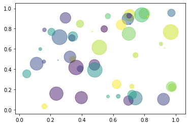

# Welcome to nbdev
> An awesome tutorial for nbdev package


Follow the instruictions below to install and use

## Install

`pip install nbdevtest101`

## How to use

Lets see it in action

```
say_hello('Kim')
```


    'Hello Kim!'


```
bubble_scatter(50)
```




